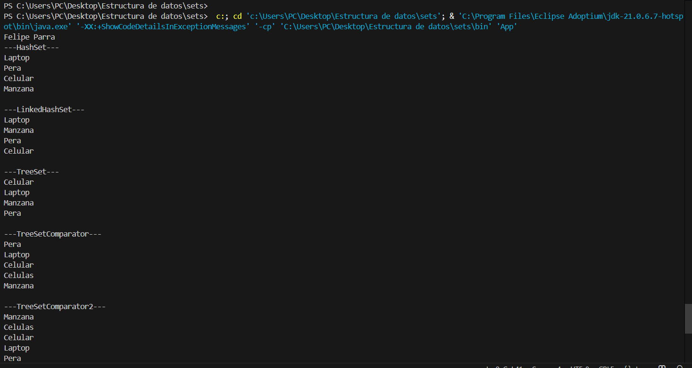
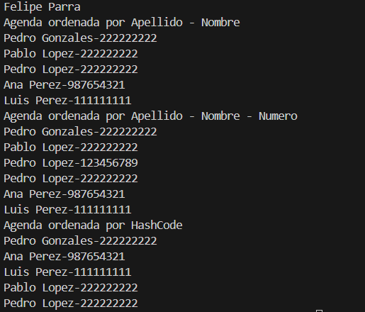
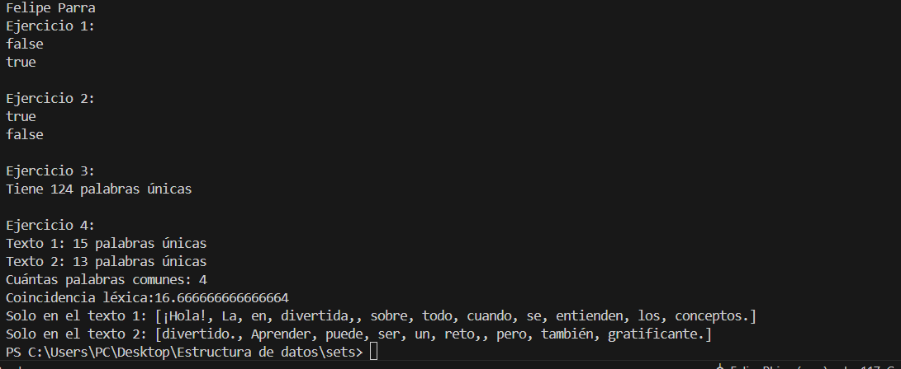

## 📌 Información General

- **Título:** Sets
- **Asignatura:** Estructura de Datos
- **Carrera:** Computación
- **Estudiante:** Felipe Parra
- **Fecha:** 01/07/2025
- **Profesor:** Ing. Pablo Torres

---

## 🛠️ Descripción

Este proyecto aplica Sets para imprimir diferentes listas en diferente orden dependiendo del tipo de set

1- El HashSet imprime aleatoriamente

2- El LinkedHashSet imprime en orden de insercion

3- El TreeSet imprime en orden alfabeticamente

4- El TreeSetConComparador imprime en orden de tamaño de palabra (de menor a mayor)

5- El TreeSetConComparador2 imprime en orden de tamaño de palabra (de mayor a menor)

## 🚀 Ejecución

Para ejecutar el proyecto:

1. Compila el código:
    ```bash
    javac App.java
    ```
2. Ejecuta la aplicación:
    ```bash
    java App
    ```

---

## 🧑‍💻 Ejemplo de Entrada

[Sets]


[Sets ordenados por diferentes condiciones]

[Ejercicios sets]